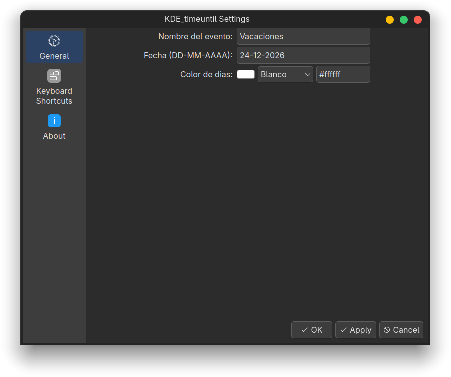

# KDE_timeuntil

KDE_timeuntil is a simple Plasma 6 widget (plasmoid) that shows how many days are left until an event.

## Features

- Minimal UI: only days left plus event title.
- Transparent widget background.
- Manual date input in DD-MM-YYYY format.
- Configurable text color for the days counter.
- Persistent settings via Plasma configuration.

## Requirements

- KDE Plasma 6
- Qt 6
- kpackagetool6

## Project Structure

- metadata.json: plasmoid metadata.
- contents/ui/main.qml: main widget UI and day-difference logic.
- contents/ui/configGeneral.qml: settings UI.
- contents/config/main.xml: configuration schema.
- po/en.po: English translation file.

## Install for Local Testing

1. Open a terminal in the project root.
2. Install or upgrade the plasmoid:

   `kpackagetool6 --type Plasma/Applet --upgrade .

3. Restart Plasma Shell:

   `kquitapp6 plasmashell`
   `plasmashell --replace >/dev/null 2>&1 & disown`

4. Optional standalone preview:

   `plasmawindowed org.kde.kde_timeuntil`

## Usage

1. Add the widget to your desktop or panel.
2. Open widget settings.
3. Set:
   - Event name
   - Event date in DD-MM-YYYY format
   - Days text color

4. Apply settings.

## Result

## Notes

- If the date format is invalid, the widget shows an invalid-date message.
- You may see unrelated warnings from other local plasmoids while running kpackagetool6. They do not affect this project if installation succeeds.
