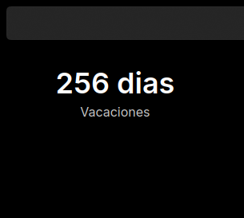

# KDE_timeuntil

A countdown to an event, as a KDE Plasma 6 desktop widget and as a small
Windows app (TimeUntil).



## Features

- Days left until the event. On the last day it switches to hours and
  minutes, then shows "Now!", "Today!" and "N days ago".
- Date and time picked from a calendar and a time picker.
- The event's date and time under its name, formatted for your language.
- A notification when the event starts.
- Transparent background and a configurable text color.
- English and Spanish.

## Plasma widget

Requires KDE Plasma 6. The settings page uses Kirigami Addons, which comes
with Plasma.

### Install

From a release, download `KDE_timeuntil-<version>.plasmoid` and either use
*Add Widgets → Get New → Install Widget From Local File*, or run:

```sh
kpackagetool6 --type Plasma/Applet --install KDE_timeuntil-<version>.plasmoid
```

From this repository (use `--install` the first time):

```sh
kpackagetool6 --type Plasma/Applet --upgrade plasma/
systemctl --user restart plasma-plasmashell
```

To try it in a window without touching the desktop:

```sh
plasmawindowed org.kde.kde_timeuntil
```

### Upgrading from 1.0

Existing widgets keep their event. Dates saved by 1.0 have no time, so they
count down to midnight; open the settings to add one.

## Windows app

Works on Windows 10 and 11. Download `TimeUntil-<version>-setup.exe` or the
portable zip from the releases page. Builds of every commit are available as
GitHub Actions artifacts.

- Each countdown is a window on the desktop. Drag it to move it.
- Right-click a countdown for *Edit…*, *New countdown*, *Lock position*,
  *Remove* and *Quit*.
- The notification area icon offers *New countdown*, *Start with Windows* and
  *Quit*.
- Countdowns stay visible when you show the desktop (Win+D).

Settings are stored under `HKEY_CURRENT_USER\Software\TimeUntil`.

## Development

### Layout

- `plasma/`: the Plasma widget package (`metadata.json`, `contents/`).
  - `contents/code/countdown.mjs`: countdown logic, shared with the Windows app.
  - `contents/ui/CountdownView.qml`: countdown text, shared with the Windows app.
- `windows/`: the Qt 6 app. Its CMake project compiles the shared files in.
- `po/`: translations used by both versions.
- `tests/`: unit tests for `countdown.mjs`.
- `scripts/`: translation, icon and packaging helpers.

### Tests

```sh
node --test 'tests/*.test.mjs'
```

### Windows app

Needs Qt 6.8 or later (CI uses 6.11) and CMake. It also builds and runs on
Linux for development; keeping windows visible on Win+D and starting with
Windows only work on Windows.

```sh
cmake -S windows -B build/windows
cmake --build build/windows
./build/windows/TimeUntil
```

### Translations

1. `scripts/extract-messages.sh` updates `po/timeuntil.pot` and merges it into
   the `.po` files.
2. Translate `po/<language>.po`.
3. `scripts/build-translations.sh` compiles the files into the widget package.
   Commit the generated `.mo` too. The Windows app reads the `.po` files when
   it is built.

To check a language, run `LANGUAGE=es plasmawindowed org.kde.kde_timeuntil`
or `LANGUAGE=es ./build/windows/TimeUntil`.

### Releases

Pushing a tag such as `v1.1.0` makes CI publish the `.plasmoid`, the Windows
installer and a portable zip as a GitHub release.

## License

GPL-3.0-or-later. The Windows app includes Qt under the LGPLv3; see
`windows/installer/THIRD-PARTY-NOTICES.txt`.
