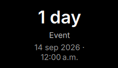

# KDE_timeuntil

A countdown to an event, as a KDE Plasma 6 desktop widget and as a small
Windows app (TimeUntil). By Alonso Contreras.

| KDE Plasma | Windows |
| --- | --- |
|  |  |

## Features

- Days left until the event. On the last day it switches to hours and
  minutes, then shows "Now!", "Today!" and "N days ago".
- Date and time picked from a calendar and a time picker.
- The event's date and time under its name, formatted for your language.
- A notification when the event starts.
- Transparent background and a configurable text color.
- English and Spanish.

See [CHANGELOG.md](CHANGELOG.md) for what changed in each version.

## Installation guides

- [KDE Plasma widget](docs/install-plasma.md): install, add to the desktop,
  configure, update and remove.
- [Windows app](docs/install-windows.md): download, install, use, start with
  Windows and uninstall.

## Plasma widget

Requires KDE Plasma 6. The settings page uses Kirigami Addons, which comes
with Plasma.

Quick install from this repository (use `--install` the first time):

```sh
kpackagetool6 --type Plasma/Applet --upgrade plasma/
systemctl --user restart plasma-plasmashell
```

To try it in a window without touching the desktop:

```sh
plasmawindowed org.kde.kde_timeuntil
```

## Windows app

Works on Windows 10 and 11. Download `TimeUntil-<version>-setup.exe` or the
portable zip from the
[releases page](https://github.com/alonsocontree/KDE_timeuntil/releases), or
the latest build from the
[Actions page](https://github.com/alonsocontree/KDE_timeuntil/actions)
(*Artifacts* section, you need to be signed in to GitHub).

- Each countdown is a window on the desktop that you can drag, lock, edit and
  remove from its right-click menu.
- The notification area icon adds countdowns and turns *Start with Windows*
  on or off.
- Countdowns stay visible when you show the desktop (Win+D).

## Development

### Layout

- `plasma/`: the Plasma widget package (`metadata.json`, `contents/`).
  - `contents/code/countdown.mjs`: countdown logic, shared with the Windows app.
  - `contents/ui/CountdownView.qml`: countdown text, shared with the Windows app.
- `windows/`: the Qt 6 app. Its CMake project compiles the shared files in.
- `po/`: translations used by both versions.
- `tests/`: unit tests for `countdown.mjs`.
- `scripts/`: translation, icon and packaging helpers.
- `docs/`: installation guides; their screenshots are in `img/`.

### Tests

```sh
node --test 'tests/*.test.mjs'
```

### Windows app

Needs Qt 6.8 or later and CMake. It also builds and runs on Linux for
development; keeping windows visible on Win+D and starting with Windows only
work on Windows.

```sh
cmake -S windows -B build/windows
cmake --build build/windows
./build/windows/TimeUntil
```

### Continuous integration

`.github/workflows/ci.yml` runs on every push and pull request. It tests
`countdown.mjs` in several time zones, packages the `.plasmoid`, and builds the
Windows app, its portable folder and its installer.

CI builds the Windows app with Qt 6.8.3 LTS, because the released aqtinstall
cannot install Qt 6.11 yet
([miurahr/aqtinstall#959](https://github.com/miurahr/aqtinstall/issues/959)).

### Translations

1. `scripts/extract-messages.sh` updates `po/timeuntil.pot` and merges it into
   the `.po` files.
2. Translate `po/<language>.po`.
3. `scripts/build-translations.sh` compiles the files into the widget package.
   Commit the generated `.mo` too. The Windows app reads the `.po` files when
   it is built.

To check a language, run `LANGUAGE=es plasmawindowed org.kde.kde_timeuntil`
or `LANGUAGE=es ./build/windows/TimeUntil`.

### Releases

1. Update the version in `plasma/metadata.json` and `windows/CMakeLists.txt`,
   and add the release to `CHANGELOG.md`.
2. Push a tag such as `v1.1.0`. CI publishes the `.plasmoid`, the Windows
   installer and a portable zip as a GitHub release.

## License

Copyright (C) 2026 Alonso Contreras.

GPL-3.0-or-later. The Windows app includes Qt under the LGPLv3; see
`windows/installer/THIRD-PARTY-NOTICES.txt`.
