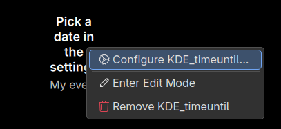
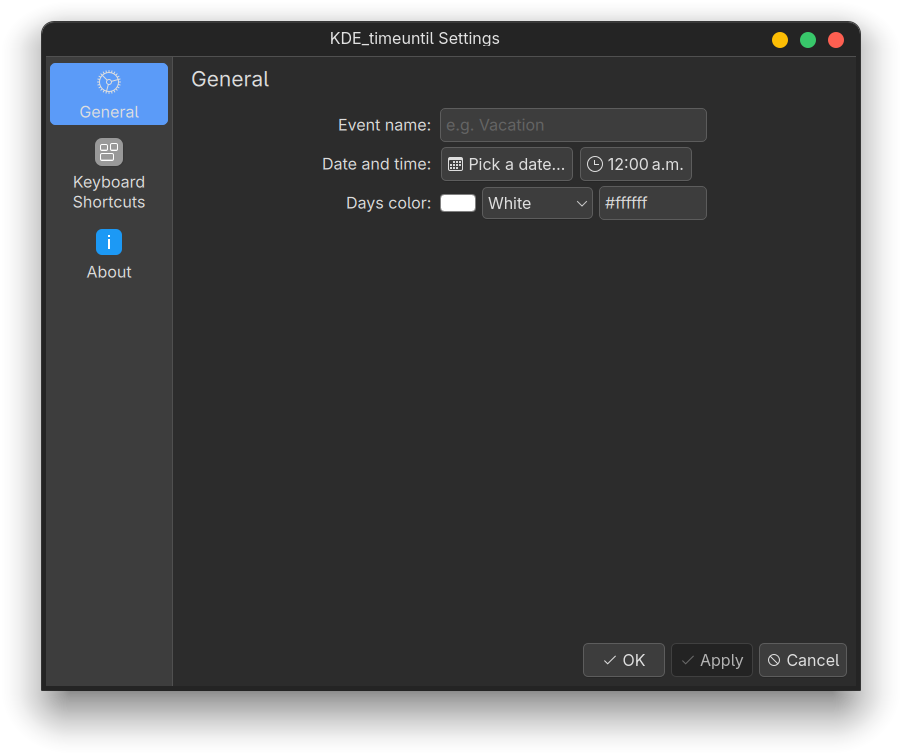
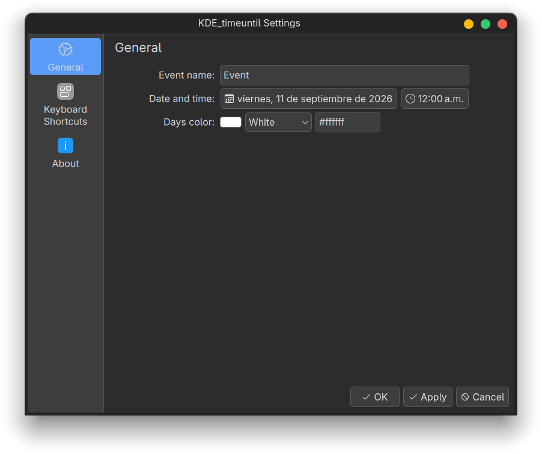

# Installing the KDE Plasma widget

KDE_timeuntil is a desktop widget for KDE Plasma 6 that counts down to an event.

The screenshots were taken on Plasma with Spanish regional settings, which is
why the date in the settings page appears in Spanish. The widget follows your
system's language and date format.

## Requirements

- KDE Plasma 6.
- Kirigami Addons, used by the date and time pickers. It is installed with
  Plasma.

## 1. Install the widget

Choose one of these options.

**From a `.plasmoid` file.** Download `KDE_timeuntil-<version>.plasmoid` from
the [releases page](https://github.com/alonsocontree/KDE_timeuntil/releases).
Then right-click the desktop, choose **Add or Manage Widgets…**, click
**Get New → Install Widget From Local File…** and select the file.

**From a terminal**, with the same file:

```sh
kpackagetool6 --type Plasma/Applet --install KDE_timeuntil-<version>.plasmoid
```

**From this repository:**

```sh
git clone https://github.com/alonsocontree/KDE_timeuntil.git
cd KDE_timeuntil
kpackagetool6 --type Plasma/Applet --install plasma/
```

## 2. Add it to the desktop

Right-click the desktop and choose **Add or Manage Widgets…**. Search for
**KDE_timeuntil** and drag it onto the desktop.

Until you pick a date, the widget asks for one.


## 3. Set up your event

Right-click the widget and choose **Configure KDE_timeuntil…**.



The settings page opens.



1. **Event name:** type a name for the event.
2. **Date and time:** click **Pick a date…** to choose the day in a calendar,
   and click the time button to choose the hour and minutes.
3. **Days color:** choose a color for the countdown, or type one such as
   `#ffd54f`.
4. Click **OK**, or **Apply** to keep the window open.



## 4. Watch the countdown

The widget shows the time left, the event's name, and its date and time.


- While at least a day is left, it shows days, such as "13 days".
- On the last day, it shows hours and minutes, such as "5 h 20 min".
- When the event starts, it shows "Now!" and a notification appears.
- For the rest of that day it shows "Today!", and afterwards "3 days ago".

To count down to several events, add one widget for each.

## Update

Install the new version over the old one, then restart Plasma so it loads the
new files:

```sh
kpackagetool6 --type Plasma/Applet --upgrade KDE_timeuntil-<version>.plasmoid
systemctl --user restart plasma-plasmashell
```

From the repository, use `plasma/` instead of the `.plasmoid` file.

Widgets from version 1.0 keep their event. Their dates had no time, so they
count down to midnight; open the settings to add a time.

## Remove

To remove one widget, right-click it and choose **Remove KDE_timeuntil**. To
uninstall the widget completely:

```sh
kpackagetool6 --type Plasma/Applet --remove org.kde.kde_timeuntil
```
