# Installing TimeUntil on Windows

TimeUntil shows countdowns to your events on the Windows desktop. It works on
Windows 10 and 11.

The screenshots were taken on Windows 11 set to Spanish. TimeUntil and its
installer follow the language of your system, so you may see them in English.

## 1. Download

- **From a release:** download `TimeUntil-<version>-setup.exe` from the
  [releases page](https://github.com/alonsocontree/KDE_timeuntil/releases) and
  go to step 3.
- **Latest build:** open the newest run on the
  [Actions page](https://github.com/alonsocontree/KDE_timeuntil/actions) and
  download `TimeUntil-windows-installer` from its *Artifacts* section. You need
  to be signed in to GitHub. The download is a zip file.

## 2. Extract the zip (Actions builds only)

Right-click `TimeUntil-windows-installer.zip` and choose **Extract All…**.

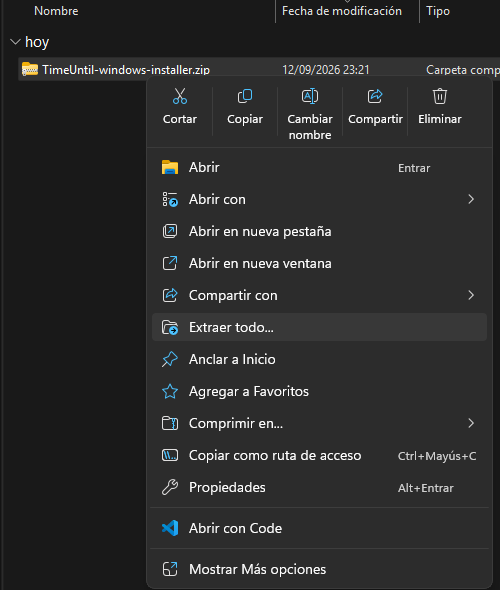

Keep the suggested folder, or choose another one, and click **Extract**.

## 3. Run the installer

Open `TimeUntil-<version>-setup.exe`.

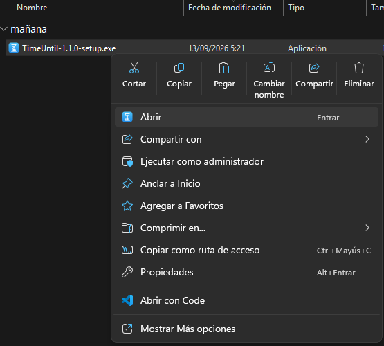

The installer is not signed, so Windows SmartScreen may warn about it. Choose
**More info → Run anyway**. It installs TimeUntil for your user account only and
does not need administrator rights.

Choose the language for the installer.

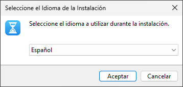

Read the license (GNU GPL version 3), select **I accept the agreement** and click
**Next**.

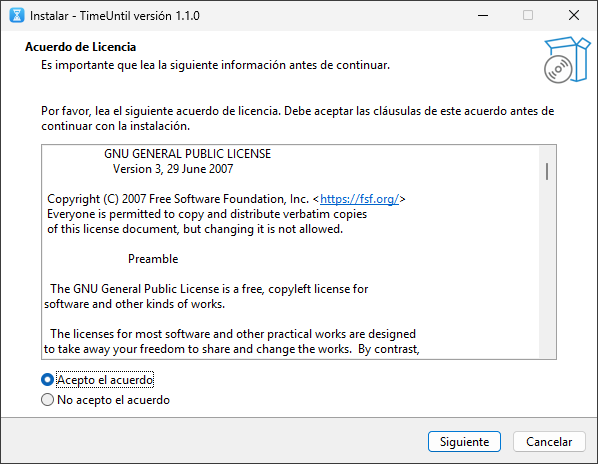

**Automatically start TimeUntil** makes your countdowns appear every time you
sign in. It is selected by default; clear it if you prefer to start TimeUntil
yourself. You can change this later from the notification area icon.

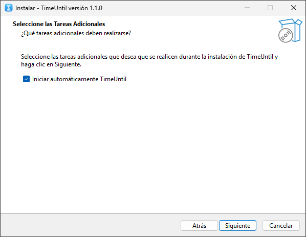

Review the summary and click **Install**.

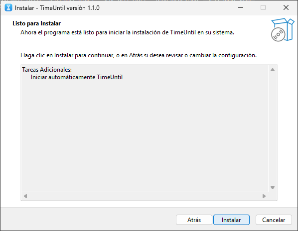

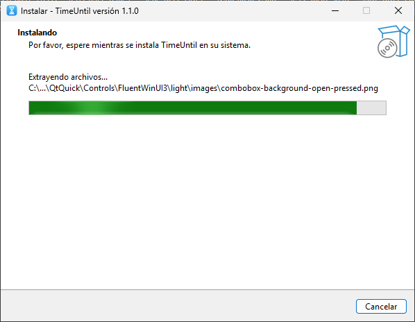

Leave **Launch TimeUntil** selected and click **Finish**.

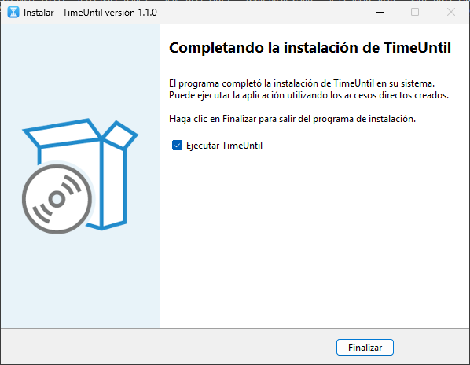

## 4. Use TimeUntil

The first time it starts, TimeUntil shows a countdown on the desktop. Each
countdown shows the time left, the event's name, and its date and time.

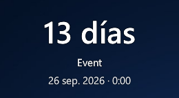

Drag a countdown to move it. Right-click it for these options:

- **Edit…**: change the event's name, date, time and color.
- **New countdown**: add another countdown and open its settings.
- **Lock position** / **Unlock position**: stop or allow dragging.
- **Remove**: delete the countdown. It is disabled when there is only one.
- **Quit**: close TimeUntil.

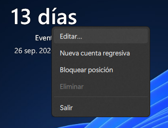

### Edit a countdown

In the settings dialog:

1. Type the event's name.
2. Pick the day in the calendar. Use **‹** and **›** to change the month.
3. Scroll the hour and minute wheels to set the time.
4. Choose a color for the countdown, or type one such as `#ffd54f`.
5. Click **Save**.

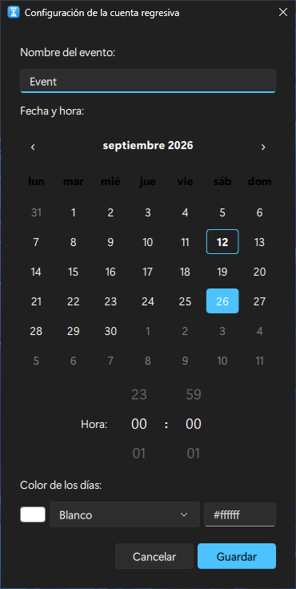

### Add more countdowns

Choose **New countdown** in the right-click menu or in the notification area
icon.

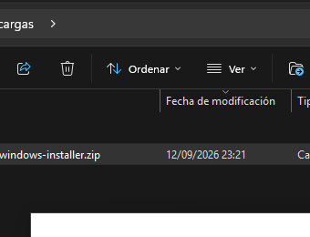

A new countdown appears and its settings open, so you can set it up right away.

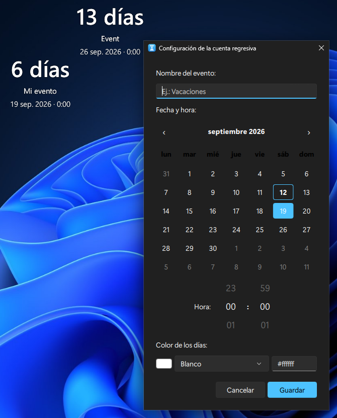

### How the countdown changes

- While at least a day is left, it shows days, such as "13 days".
- On the last day, it shows hours and minutes, such as "5 h 20 min".
- When the event starts, it shows "Now!" and a notification appears.
- For the rest of that day it shows "Today!", and afterwards "3 days ago".

## Notification area icon

TimeUntil keeps running in the notification area, next to the clock. Windows 11
may hide the icon under the **^** arrow on the taskbar. Right-click the
hourglass icon for:

- **New countdown**
- **Start with Windows**: turn automatic start on or off.
- **Quit**

## Show desktop

Countdowns stay visible when you press **Win+D** or click the end of the taskbar
to show the desktop. They go back behind your windows when you open another
application.

## Uninstall

Open **Settings → Apps → Installed apps**, find **TimeUntil** and choose
**Uninstall**. This also removes the automatic start.

Your countdowns stay stored under `HKEY_CURRENT_USER\Software\TimeUntil`, so
they come back if you install TimeUntil again.

## Portable version

Builds also include a version that needs no installation: the
`TimeUntil-<version>-windows.zip` release file, or the `TimeUntil-windows`
artifact. Extract it to a folder of your choice and open `TimeUntil.exe`. To
start it with Windows, use **Start with Windows** in the notification area
icon.
